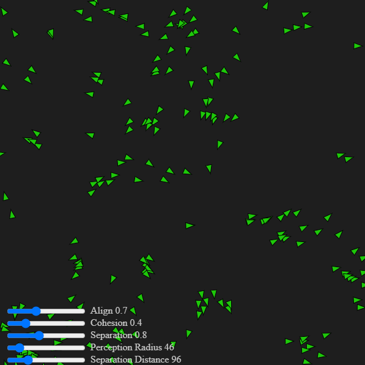

# Flocking Simulator

This project is a physical simulation demonstrating **emergent behavior**, a fascinating concept where complex, collective patterns arise from simple interactions between individual agents. The simulation models a "flocking" system, where agents (or "boids") move together based on three fundamental rules:

  * **Separation:** Steer to avoid crowding local flockmates.
  * **Alignment:** Steer towards the average heading of local flockmates.
  * **Cohesion:** Steer to move toward the average position (center of mass) of local flockmates.

## ✨ Features

  * **Real-time Physics Simulation:** Watch as the agents dynamically react to each other in real-time.
  * **Interactive Controls:** Users can interact with the simulation to observe changes in flocking behavior.
  * **Configurable Parameters:** Easily adjust the rules (separation, alignment, cohesion) to see how each one impacts the overall group dynamic.

## 🛠️ Technologies Used

  * **JavaScript:** The entire project is built using vanilla JavaScript, showcasing a strong understanding of core web development concepts.
  * **p5.js:** Used for rendering and manipulation of bodies in the system
  * **HTML5:** Provides the canvas for the simulation to be rendered.
  * **CSS3:** Used for styling the user interface.

## 🚀 Live Demo

Click the picture to try for yourself

More about it on my website at [Asaf's Laboratory](https://asafslaboratory.com/?p=100)

## 🙏 Acknowledgments

This project was inspired by the fantastic work of **The Coding Train**, particularly their educational content on flocking simulations. A big thank you to them for providing the foundational knowledge that made this project possible.
